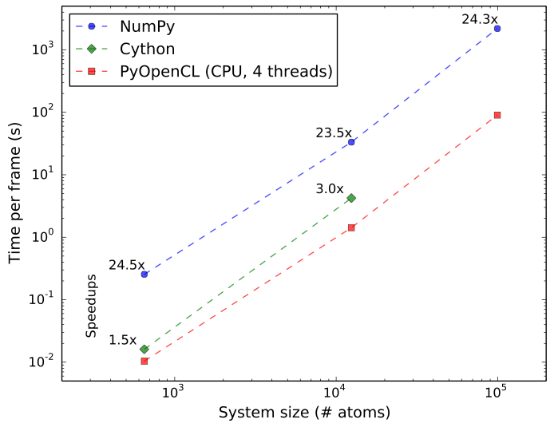

===============================
Parallelized radial distribution function
===============================

This was primarily for a class project on parallelization. 
If I (hopefully) find some time in the future, I may continue tinkering
with it to the point where it's useable as a standalone RDF calculator
for a variety hardware.

Quick benchmarks from the class project
---------------------------------------

